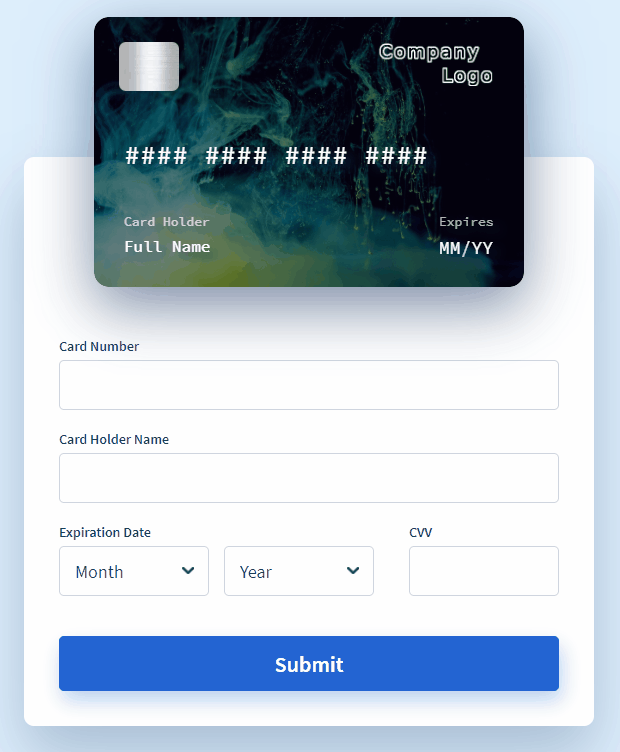

# ngx-interactive-paycard

A parameterizable animated payment card built with Angular. 
[See live demo here.](https://ngx-interactive-paycard.netlify.app/)

<p align="center">
  
</p>

# Using the library
The library is published in Angular package format on in the global registry of `npmjs`. To install the library run in the consumer project following command:

```bash
npm install ngx-interactive-paycard 
```

Import the module of the paycard:

```javascript
import { InteractivePaycardModule } from 'ngx-interactive-paycard';

@NgModule({
  ...
  imports: [
    ...
    InteractivePaycardModule,
    ...
  ],
  ...
})
export class UsedModule { }
```

To embed the card use the `<ngx-interactive-paycard>` selector. 

It has following input parameters:
* `chipImgPath`: The path of the image which should be displayed as chip on the card.
* `logoImagePath`: The path of the company logo image.
* `frontBgImagePath`: The path of the card front background image.
* `backBgImagePath`: The path of the card back background image.
* `cardNumberFormat`: The format of the card number specified with `#` charaters.<br/> For example `"#### #### #### ####"` is a pattern for Master or VISA cards.
* `cardNumberMask`: Specifies which part of the card number should be masked. The masked characters are defined using `*` character the unmasked numbers are defined with `#` character. For example `"#### **** **** ####"` masks the middle of the card number. Note that it should have the same number of characters as the `cardNumberFormat` has.
* `cardLabels`: Optional property to modify all labels in the card component.
* `formLabels`: Optional property to modify all labels in form component.

The output parameters are following:
* `submitEvent`: It is fired if the Submit button is clicked. The event contains all the card data.
* `changeCard`: It is fired if one of the card properties change. The event contains all the card data.
* `changeCardNumber`: It is fired if the card number changes. The event contains the card number.

An example for the usage can be found below. The example assumes, that the consumer `assets` folder contains the necessary images.

```html
<ngx-interactive-paycard 
    [chipImgPath]="'./assets/chip.png'" 
    [logoImgPath]="'./assets/logo.png'"
    [frontBgImgPath]="'./assets/SplitShire1.jpg'" 
    [backBgImgPath]="'./assets/SplitShire3.jpg'"
    [cardNumberFormat]="cardNumberFormat" 
    [cardNumberMask]="cardNumberMask" 
    [cardLabels]="cardLabel"
    [formLabels]="formLabel"
    (submitEvent)="onSubmitEvent($event)"
    (changeCard)="showChangesCard($event)"
    (changeCardNumber)="showChangesCardNumber($event)"
    >
</ngx-interactive-paycard>
```

And the component code for it:

```javascript
@Component({
  selector: 'app-root',
  templateUrl: './app.component.html',
  styleUrls: ['./app.component.scss']
})
export class AppComponent {
  title = 'ngx-interactive-paycard-demo';
  cardNumberFormat = "#### #### #### ####";
  cardNumberMask = "#### **** **** ####";
  //ex: Optional cardLabels - Spanish
  cardLabel: CardLabel = {
    expires: 'Expira',
    cardHolder: 'Nombre del Titular',
    fullName: 'Nombre completo',
    mm: 'MM',
    yy: 'AA',
  };
  //ex: Optional formLabels - Spanish
  formLabel: FormLabel = {
    cardNumber: 'Número de Tarjeta',
    cardHolderName: 'Titular de la Tarjeta',
    expirationDate: 'Fecha de Expiracion',
    expirationMonth: 'Mes',
    expirationYear: 'Año',
    cvv: 'CVV',
    submitButton: 'Enviar',
  };
  
  onSubmitEvent($event) {
    console.log($event);
  }
  
  showChangesCard($event) {
    // any changes on card (number, name, month, year, cvv)
    console.log($event);
  }

    showChangesCardNumber($event) {
    // any changes on card number
    console.log($event);
  }
}
```

A working example can be found in the `ngx-interactive-paycard-demo` folder in this repository.


# Development of the library
To develop the library the `LTS` version of `node.js` needs to be installed. 
In this repository there is an Angular workspace which contains following projects
* `ng-interactive-paycard-lib`: The source code of the card library.
* `ng-interactive-paycard-demo`: The consumer that is used for the library development and to showcase the features of the library.

To install the dependencies of the workspace run 

```bash
npm install
```

To start the library and the demo project in watch mode run 

```bash
npm run watch:all
```

The demo of the library will be reachable on `http://localhost:4200`.

# References
This project is inspired by [vue-interactive-paycard](https://github.com/muhammederdem/vue-interactive-paycard). 

The goal of this project is to have an Angular alternative for the original vue based version.
